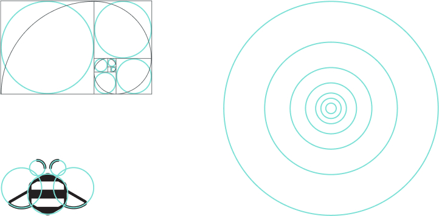
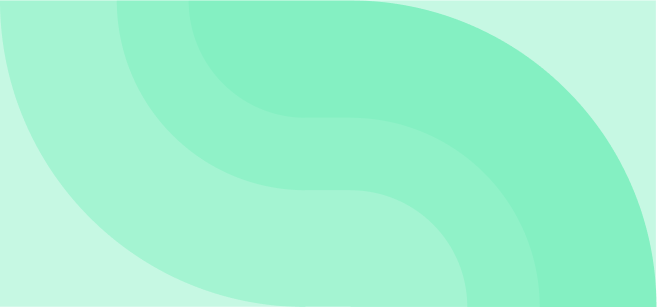
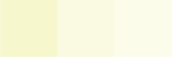

# Directives de marque

## Les concepts que nous cherchons à transmettre et les éléments qui les représentent :

* Nous souhaitons être perçus comme **sympathiques et agréables**, nous utilisons donc de nombreuses formes courbes. 
* Nous voulons transmettre la **simplicité,** comme l'abeille, sans prendre conscience de l'écosystème vaste et complexe dont elle fait partie. Nous utilisons donc des formes propres et simples. 
* 1Hive est une communauté qui ne fait pas de discrimination, nous cherchons donc à transmettre la **diversité** et nous y parvenons avec une grande variété de couleurs. Les couleurs de notre marque évoquent la variété et la diversité de couleurs que l'on peut trouver dans la nature. 
* Nous transmettons la **flexibilité** avec l'utilisation de formes organiques.

### Quelques aspects à prendre en compte

* Évitez les lignes dures et droites, et d'insister sur l'esthétique extraterrestre/insecte. 
* Notre marque doit être simple et conviviale, mais elle ne doit pas avoir l'air caricaturale \(par exemple, une abeille avec un visage\).


Vous pouvez voir les directives de marque sur ce fichier [Figma](https://www.figma.com/file/6o6Ik2f0D6HiLzRWwgeOQd/Brand-guidelines).


## Nombre d'or

Nous utilisons le nombre d'or pour les proportions du logo et dans le développement de différents éléments graphiques pour diverses raisons :

* Il est **présent dans la nature**, comme tous les concepts utilisés dans 1Hive \(abeilles, miel, ruche, pissenlit, etc.\) 
* Ce qui suit le principe du nombre d'or est **proportionnellement agréable**, nous cherchons à faire en sorte que notre identité se sente amicale, décontractée et compréhensible.
* Cela n’a pas l’air complexe à première vue, mais cache une logique intéressante. C'est fortement lié à 1Hive, car nous voulons maintenir la complexité sous la surface. Lors de nos recherches, nous avons découvert un fait curieux : **le nombre d'or est également présent dans les ruches**. Si vous divisez le nombre d'abeilles femelles par le nombre d'abeilles mâles, vous obtenez 1,618, le nombre d'or. Cette séquence mathématique fonctionne pour n'importe quelle ruche d'abeilles à tout moment.


La taille des cercles, des rectangles et des différentes formes que nous utilisons est **multipliée ou divisée par 1,618** pour respecter les proportions du nombre d'or.


## Palette de couleurs

Le turquoise est utilisé comme couleur principale pour 1Hive. Nous avons également des couleurs secondaires qui se combinent harmonieusement avec ce turquoise. Un grand nombre de combinaisons différentes sont possibles. Cela évoque la variété de couleurs que l'on trouve dans la nature.

Nous utilisons également des opacités de 40% et des éléments superposés qui permettent une gamme de couleurs plus étendue et rendent le passage d'une couleur à une autre plus harmonieux.

### Couleur primaire

### Couleurs secondaires


Consultez ce fichier [Figma ](http://figma.com/file/6o6Ik2f0D6HiLzRWwgeOQd/Brand-guidelines?node-id=15%3A48)pour vérifier les codes de couleur HEX et d'autres détails tels que l'échelle de gris et le dégradé de l'arrière-plan.


## Contenu téléchargeable

[1Hive Design Assets](https://mega.nz/folder/t8dmmJZL) contient les logos, les titres et la police ubuntu. Nécessite la clé de déchiffrement `giPbW4M9wRTApPF0J6VkgA`

[Visuels et animations créés par la communauté](http://bit.ly/2X7bOER).

